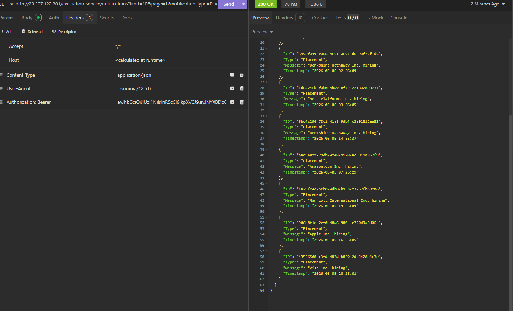
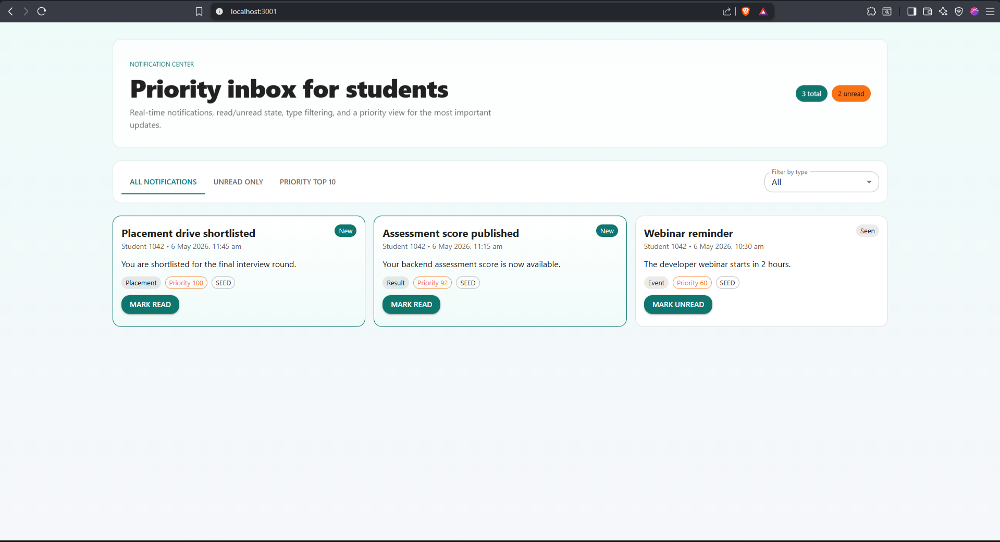
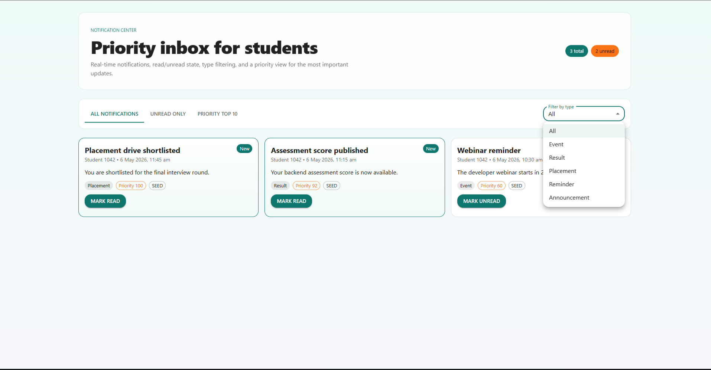
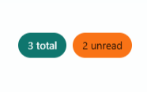
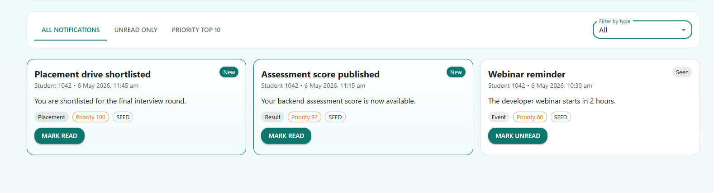
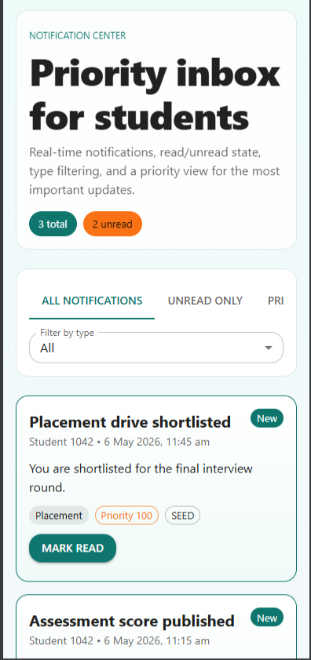
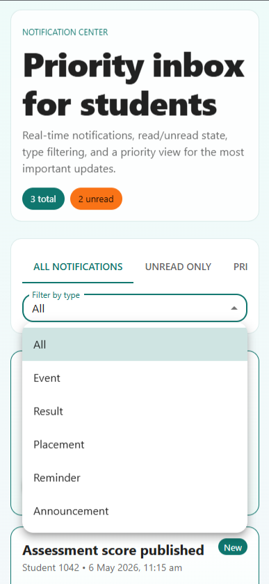
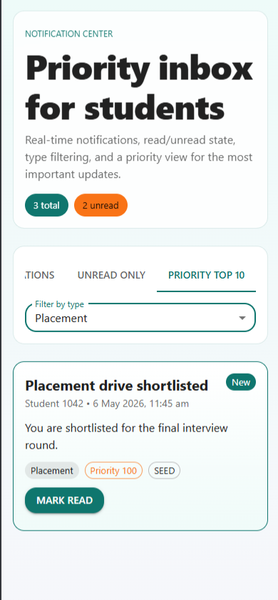

# Submission Notes

I wrote this as a practical build log for the assessment. The goal is to keep the technical decisions clear, but explain them in plain language so the reader can follow the reasoning without having to reverse-engineer the implementation.

# Stage 1 - How I framed the problem

## What I assumed

- Backend API is built in TypeScript with Express.
- Frontend is built in React with TypeScript and Material UI.
- API-client evidence will be captured from Postman with request body, response body, headers, and response time.

## What the platform needs to do

The core actions I planned for were:

- list notifications for a student
- filter by read/unread state
- filter by notification type
- mark a notification read or unread
- bulk-create notifications for a set of students
- fetch the top priority notifications for inbox rendering
- sync notifications from the external Notification API

## REST Contract

### GET /api/notifications

Query parameters:

- `studentId` optional
- `isRead` optional boolean
- `type` optional notification type
- `limit` optional number

Example response:

```json
[
  {
    "id": "notif_1",
    "studentId": 1042,
    "type": "Placement",
    "title": "Placement drive shortlisted",
    "message": "You are shortlisted for the final interview round.",
    "priorityScore": 100,
    "createdAt": "2026-05-06T08:00:00.000Z",
    "isRead": false,
    "source": "seed"
  }
]
```

### POST /api/notifications/bulk

Request body:

```json
{
  "studentIds": [1042, 1043],
  "type": "Placement",
  "title": "Final interview scheduled",
  "message": "Please attend the interview at 10:30 AM.",
  "priorityScore": 95
}
```

Example response:

```json
{
  "createdCount": 2,
  "notifications": []
}
```

### PATCH /api/notifications/:id/read

Request body:

```json
{
  "isRead": true
}
```

### GET /api/notifications/top

Query parameters:

- `studentId` optional
- `limit` optional, default 10

## Headers

- `Content-Type: application/json`
- `x-request-id` optional; generated by the backend if missing

## How I’d handle updates

For the assessment, I kept the approach simple and reliable: a polling-friendly API plus frontend refresh hooks. If the product later needs live updates, the same payload can be carried over to SSE or WebSocket without changing the notification shape.

# Stage 2 - Data model and indexing

## Why PostgreSQL

I chose PostgreSQL.

That choice fits the workload because:

- notifications have structured fields and predictable query patterns
- unread and per-student lookups benefit from composite indexes
- bulk inserts, updates, and joins are straightforward in a relational model
- the schema fits the notification contract from Stage 1 without extra transformation

## Suggested schema

```sql
CREATE TABLE notifications (
  id UUID PRIMARY KEY,
  student_id BIGINT NOT NULL,
  type VARCHAR(32) NOT NULL,
  title VARCHAR(200) NOT NULL,
  message TEXT NOT NULL,
  priority_score INT NOT NULL DEFAULT 50,
  is_read BOOLEAN NOT NULL DEFAULT FALSE,
  source VARCHAR(16) NOT NULL DEFAULT 'live',
  created_at TIMESTAMP NOT NULL DEFAULT NOW(),
  updated_at TIMESTAMP NOT NULL DEFAULT NOW()
);

CREATE INDEX idx_notifications_student_read_created
  ON notifications (student_id, is_read, created_at DESC);

CREATE INDEX idx_notifications_student_type_created
  ON notifications (student_id, type, created_at DESC);

CREATE INDEX idx_notifications_priority_created
  ON notifications (priority_score DESC, created_at DESC);
```

## What breaks as traffic grows

- full table scans become expensive for unread and filtered inbox queries
- bulk notification fan-out increases write pressure
- sorting by recency or priority gets slower without the right indexes
- repeated page loads can overload the database with the same read query
- marking notifications read/unread at high frequency increases update contention

## How I’d keep it stable

- use composite indexes that match the query pattern exactly
- paginate or limit notification reads instead of returning everything
- cache unread counts and top-priority inbox items for short periods
- separate read-heavy endpoints from write-heavy fan-out workflows
- if the dataset grows very large, partition by tenant, cohort, or time range
- move bulk delivery to async processing so the user request does not wait on every insert

## SQL Queries

Unread notifications for a student:

```sql
SELECT id, student_id, type, title, message, priority_score, created_at, is_read, source
FROM notifications
WHERE student_id = $1 AND is_read = FALSE
ORDER BY created_at DESC
LIMIT $2;
```

Filter by type:

```sql
SELECT id, student_id, type, title, message, priority_score, created_at, is_read, source
FROM notifications
WHERE student_id = $1 AND type = $2
ORDER BY created_at DESC;
```

Fetch the top priority inbox items:

```sql
SELECT id, student_id, type, title, message, priority_score, created_at, is_read, source
FROM notifications
WHERE student_id = $1
ORDER BY priority_score DESC, created_at DESC
LIMIT $2;
```

Bulk insert for a placement event:

```sql
INSERT INTO notifications (id, student_id, type, title, message, priority_score, is_read, source)
VALUES (gen_random_uuid(), $1, 'Placement', $2, $3, $4, FALSE, 'live');
```

Mark a notification as read:

```sql
UPDATE notifications
SET is_read = TRUE, updated_at = NOW()
WHERE id = $1 AND student_id = $2;
```

## How this maps back to the API

The REST endpoints from Stage 1 map cleanly to the schema:

- `GET /api/notifications` maps to filtered `SELECT` queries
- `GET /api/notifications/top` maps to a priority-ordered `SELECT`
- `POST /api/notifications/bulk` maps to `INSERT` operations for multiple students
- `PATCH /api/notifications/:id/read` maps to the update query above

# Stage 3 - Query review

## The query I reviewed

The query is logically correct for the intended result, but it is not the version I would keep for the real workload:

```sql
SELECT * FROM notifications
WHERE studentID = 1042 AND isRead = false
ORDER BY createdAt ASC;
```

It is slow because:

- `SELECT *` reads more columns than the API usually needs
- `studentID` and `isRead` may not be supported by a useful composite index
- sorting by `createdAt ASC` can still require a sort step if the index does not match the order
- at 50,000 students and 5,000,000 notifications, the database must inspect a much larger working set

## What I would change

Use only the needed columns, filter by the current student, sort newest unread notifications first, and paginate or limit the result set:

```sql
SELECT id, student_id, type, title, message, priority_score, created_at, is_read, source
FROM notifications
WHERE student_id = $1 AND is_read = FALSE
ORDER BY created_at DESC
LIMIT $2;
```

Likely computational cost:

- without an index, the cost trends toward a large scan across the notification table
- with a suitable composite index, the cost drops to a targeted index range scan plus a much smaller result fetch
- the sort cost also drops if the index matches both filtering and ordering

## Why I would not index everything

Adding indexes on every column is not effective.

Why not:

- every index adds write overhead for inserts, updates, and deletes
- storage cost rises quickly
- the optimizer may still ignore irrelevant indexes
- too many indexes can make bulk notification inserts slower

Better approach:

```sql
CREATE INDEX idx_notifications_student_isread_created
  ON notifications (student_id, is_read, created_at DESC);

CREATE INDEX idx_notifications_type_created
  ON notifications (type, created_at DESC);
```

## Placement lookup

To find all students who got a placement notification in the last 7 days:

```sql
SELECT DISTINCT student_id
FROM notifications
WHERE notification_type = 'Placement'
  AND created_at >= NOW() - INTERVAL '7 days';
```

If the column is implemented as an enum, the query remains the same in logic; the database simply enforces that `notification_type` can only be `Event`, `Result`, or `Placement`.

## How this ties back to the API

- `GET /api/notifications` should use the unread query or a filtered variant of it
- `GET /api/notifications/top` should use an ordered query with a limit
- `POST /api/notifications/bulk` should avoid per-row client round trips and rely on batched inserts
- `PATCH /api/notifications/:id/read` should update one row by notification id and student id

# Stage 4 - Performance and caching

## The problem

If notifications are fetched on every page load for every student, the database gets hit repeatedly with the same kind of query. That creates unnecessary read pressure, increases latency, and makes the user experience worse when traffic grows.

## What I recommend

Use a combination of client-side caching, limited fetches, and a read-optimized data flow instead of fetching the full notification set on every page load.

Practical approach:

- fetch only the current student’s notifications
- return only the required subset, such as unread or top-priority items
- cache the response briefly on the client
- refresh data only when needed, not on every route transition
- use pagination or a small `limit` for inbox screens
- optionally move to SSE or WebSocket if the product needs live push updates

## What gets better

- fewer repeated database queries
- smaller payloads over the network
- faster first paint on the frontend
- less sorting and filtering work on the database
- lower read amplification during busy periods

## Tradeoffs I considered

### Client Caching

Pros:

- simplest to add
- reduces repeated requests immediately
- keeps the UI responsive

Cons:

- cached data can become slightly stale
- cache invalidation needs care after mark-read or new notifications

### Pagination Or Limits

Pros:

- reduces response size
- prevents large inbox responses from blocking the page
- works well with indexes

Cons:

- the user may need to load more items manually
- not ideal if the UI must always show the full history at once

### Server Push With SSE Or WebSocket

Pros:

- real-time updates without constant polling
- better for instant inbox behavior

Cons:

- more infrastructure and connection management
- harder to scale than simple request/response

### Read Replica Or Cache Layer

Pros:

- protects the primary database from heavy read traffic
- useful when notification reads dominate

Cons:

- added operational complexity
- data may be eventually consistent depending on the setup

## Best balance for this assessment

The best practical answer is to combine short-lived client caching with indexed, limited queries. That solves the immediate overload problem without introducing unnecessary system complexity. If real-time behavior is important later, SSE is a cleaner next step than full bidirectional messaging for this use case.

# Stage 5 - Async delivery design

## What’s wrong with the naive version

The proposed loop is not reliable or fast enough:

```text
function notify_all(student_ids: array, message: string):
  for student_id in student_ids:
    send_email(student_id, message)
    save_to_db(student_id, message)
    push_to_app(student_id, message)
```

Problems:

- it runs sequentially, so 50,000 students take too long
- one failure can block the rest of the batch
- email, database insert, and push notification are tightly coupled
- the caller does not get a durable record of what succeeded or failed
- retries are hard because the function has no job or status tracking

## What I’d do if `send_email` fails for 200 students

Do not restart the whole batch from the beginning.

Instead:

- record the 200 failures separately
- retry only the failed recipients
- keep the successful ones marked as delivered
- use a retry queue with backoff
- if the error persists, move those records to a dead-letter or manual review path

This avoids duplicate emails and keeps the process moving for the remaining 49,800 students.

## Should saving to the DB and sending happen together

They should be logically related, but not executed as one blocking step in the request thread.

Why:

- database writes should be durable even if email delivery fails
- email delivery should be retriable without rewriting the full notification row
- the UI only needs an accepted job response, not the completion of every delivery

Best design:

- create a notification job
- store the notification records first
- enqueue email and push work to background workers
- update delivery status as each worker succeeds or fails

## Revised pseudocode

```text
function notify_all(student_ids: array, message: string):
  job_id = create_notification_job(student_ids, message)
  persist_notifications(job_id, student_ids, message)
  enqueue_email_and_push_jobs(job_id, student_ids, message)
  return { job_id, status: "accepted" }
```

Worker flow:

```text
function process_delivery(job_id, student_id, message):
  try:
    send_email(student_id, message)
    push_to_app(student_id, message)
    mark_delivery_success(job_id, student_id)
  catch error:
    mark_delivery_failed(job_id, student_id)
    schedule_retry(job_id, student_id)
```

## Why this is faster and more reliable

- the API returns quickly because it only enqueues work
- background workers can run in parallel
- failures are isolated to individual recipients
- retries do not duplicate successful messages
- the database keeps an audit trail of delivery status

## Final recommendation

Use asynchronous job processing with idempotent writes and per-recipient retry tracking. That is the most reliable approach for a 50,000-student placement blast, and it scales far better than a single synchronous loop.

# Stage 6 - Priority inbox

## What the inbox has to do

The priority inbox should always show the top `n` unread notifications first, where `n` can be 10, 15, 20, or any value chosen by the user or the UI.

## The priority rule

Priority should combine:

- notification type weight, where `Placement > Result > Event`
- recency, so newer items can outrank older ones when the type weight is similar

## How I implemented it

I used TypeScript for the implementation and kept it free of external algorithm libraries. The code fetches notifications from the provided Notification API and computes the top `n` items in memory using a bounded min-heap, which keeps the logic easy to audit and quick to run.

Why this approach works well:

- it does not require a database query for ranking
- it keeps only the best `n` items in memory at any time
- it scales better than sorting the full list when new notifications keep arriving
- it avoids hard-coding notifications or storing them in a local database

## How I keep it efficient

To maintain the top 10 efficiently as new notifications arrive:

- keep a min-heap of size 10
- score each incoming notification using type weight and timestamp
- if the heap is not full, insert the item
- if the heap is full and the new item is better than the current minimum, replace the minimum
- sort only the final 10 items when rendering the output

This makes the update cost per notification roughly $O(\log 10)$ instead of sorting the entire feed again.

## Code file

The working implementation is in [stage6/priority_inbox.ts](stage6/priority_inbox.ts).

## Output capture




# Stage 7 - Frontend and API testing

## What the frontend needed to show

Build a responsive React or Next.js frontend that runs on `http://localhost:3000` and uses Material UI for styling. The UI should avoid clutter, highlight important items, and work cleanly on both desktop and mobile screens.

## Pages and behavior

- show all notifications on one page
- show priority notifications on a separate page
- filter notifications by `notification_type`
- distinguish new notifications from already viewed ones
- support limited top-`n` inbox display
- keep the UI readable and production-like rather than crowded

## API testing URL for Insomnia

Use this sample URL to paste directly into Insomnia:

```text
http://20.207.122.201/evaluation-service/notifications?limit=10&page=1&notification_type=Placement
```

**Important:** This is a protected route. Add the Authorization header:

```text
Authorization: Bearer <your_access_token>
```

Other sample variations:

```text
http://20.207.122.201/evaluation-service/notifications?limit=10&page=1&notification_type=Result
http://20.207.122.201/evaluation-service/notifications?limit=10&page=1&notification_type=Event
http://20.207.122.201/evaluation-service/notifications?limit=20&page=1
```

All require the same `Authorization: Bearer <access_token>` header.

## What the response looks like

The response should contain a `notifications` array with items similar to:

```json
{
  "notifications": [
    {
      "ID": "d146095a-0d86-4a34-9e69-3900a14576bc",
      "Type": "Result",
      "Message": "mid-sem",
      "Timestamp": "2026-04-22 17:51:30"
    }
  ]
}
```

## How I approached the frontend

The frontend should fetch from the Notification API, keep the current page state in the UI, and render the top `n` notifications without storing them in a database. A bounded in-memory priority list or heap is enough for the top-10 inbox view, while the all-notifications page can render the paginated API response directly.

## Screenshot requirement

After pasting the sample URL into Insomnia and confirming the output, take screenshots of:

- the API response in Insomnia
- the React desktop view
- the React mobile view

I already captured the API response evidence in Stage 6, so Stage 7 only needs the desktop and mobile UI screenshots.












